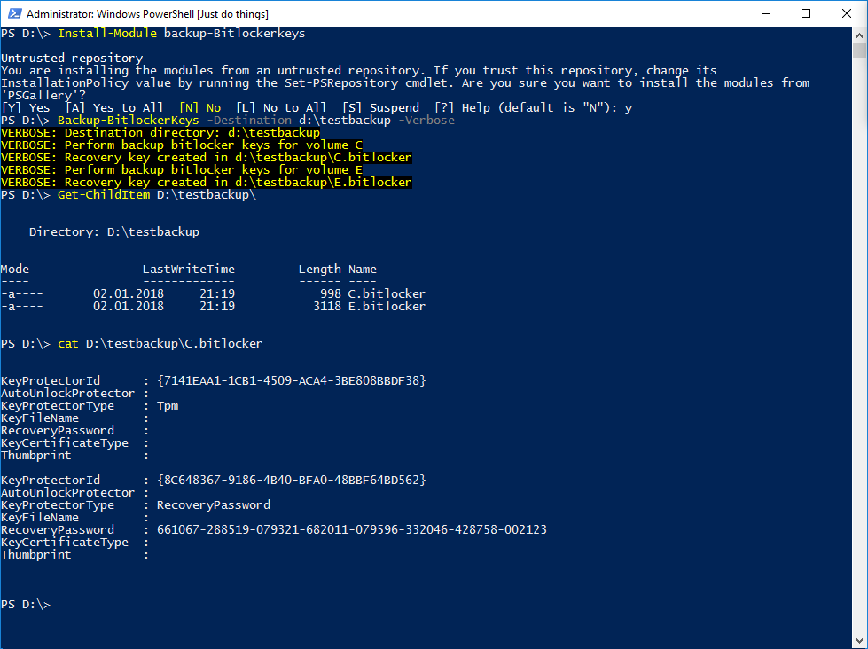
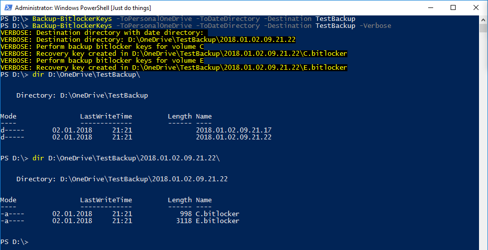

<!--Category:PowerShell--> 
 

    
    <a href="http://productivitytools.tech/backup-bitlockerkeys/"><a> 
    

    

# PSBackup-BitlockerKeys
It gets all bit-locker volumes and saves recovery keys to specified localization.

<!--more-->

It checks all connected drives if any of them is bit-locker protected. If this situation occurs it saves recovery password to given location.

`Backup-BitlockerKeys -Destination d:\destination`

`Backup-BitlockerKeys -Destination d:\destination -ToDateDirectory`

<!--og-image-->

Module depends on Get-DateName and Get-OneDriveDirectory so it can automatically detect where OneDrive directory is placed and save file in the directory which has date in the name.

`Backup-BitlockerKeys -Destination destination -ToDateDirectory -ToPersonalOneDrive`

`Backup-BitlockerKeys -Destination destination -ToDateDirectory -ToBusinessOneDrive`

It can be installed using powershell using commant

`Install-Module Backup-BitlockerKeys`
